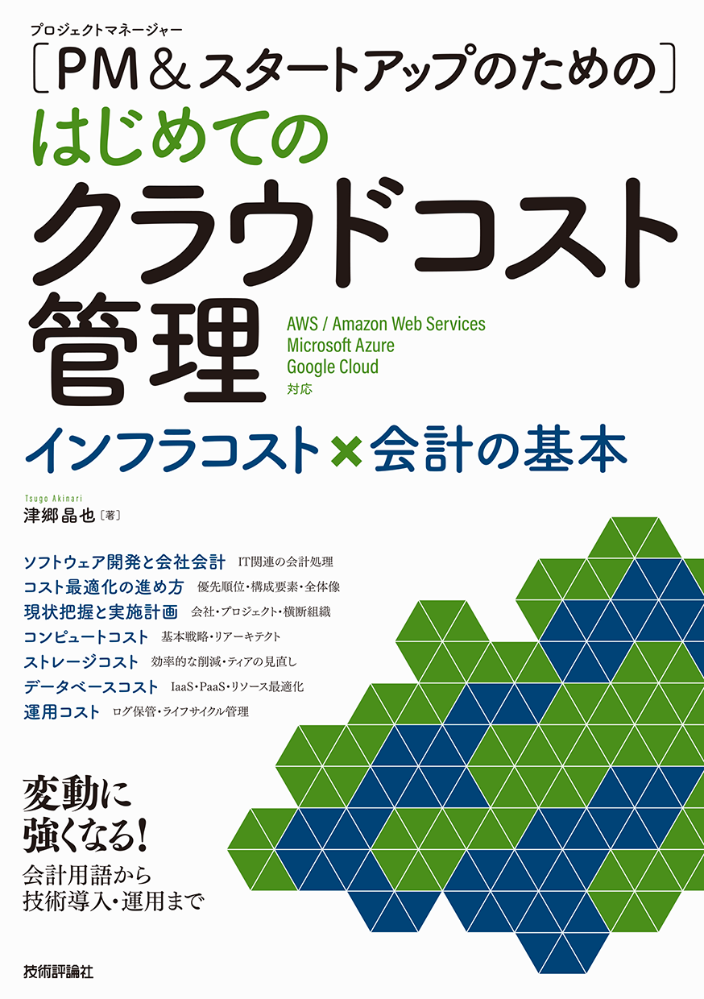

本サイトは **"[PM&amp;スタートアップのための] はじめてのクラウドコスト管理"** のサポートページです。
書籍に関連する情報、正誤情報などを掲載します。

## 🗒️目次

1. [書籍情報](#書籍情報)
1. [正誤情報](#正誤情報)

## 📖書籍情報

<table style="border: none;">
  <tr>
    <td>タイトル</td>
    <td>[PM&amp;スタートアップのための]はじめてのクラウドコスト管理</td>
  </tr>
  <tr>
    <td>著者</td>
    <td>津郷 晶也 (Akinari Tsugo)</td>
  </tr>
  <tr>
    <td>出版社</td>
    <td>技術評論社</td>
  </tr>
  <tr>
    <td>ページ数</td>
    <td>272ページ</td>
  </tr>
</table>

## 📝正誤情報

正誤情報が出てきた際に更新します。

